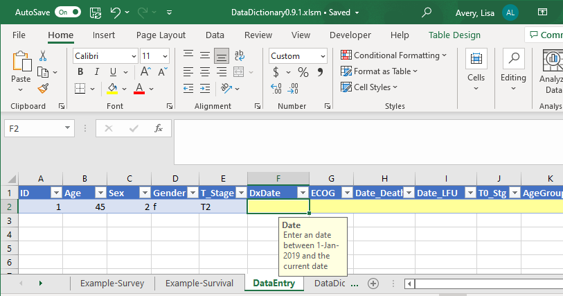

<!-- README.md is generated from README.Rmd. Please edit that file -->

```{r, include = FALSE}
knitr::opts_chunk$set(
  collapse = TRUE,
  comment = "#>"
)
```

# Excel Data Template


The Excel Data Template is a macro-enabled Excel workbook to facilitate validated data entry. Users specify the variables in the DataDictionary and run a macro to create a Data Entry sheet with embedded validation rules from the data dictionary.




## Downloading the Excel Template 
[Click Here](https://github.com/biostatsPMH/ExcelDataTemplate/blob/main/DataDictionary0.1.0.xlsm)
and then click the download button 


[Online Documentation](https://biostatsPMH.github.io/ExcelDataTemplate/)

PDF Documentation: [Click
Here](https://biostatsPMH.github.io/ExcelDataTemplate/ExcelTemplateGuide.pdf)
and then click on `Download`
